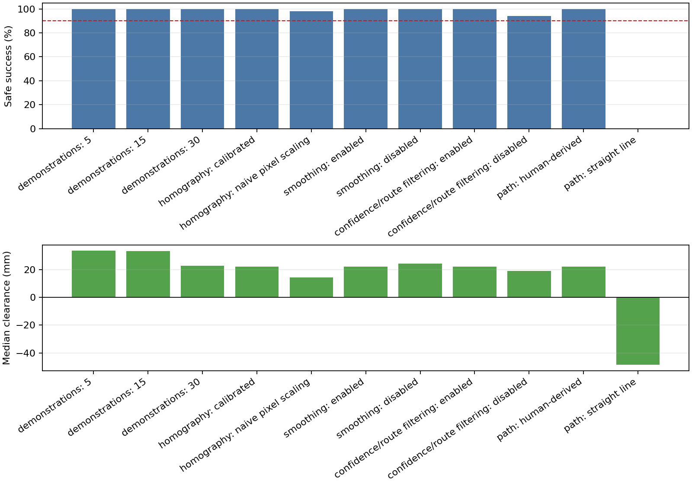

# Phone2Panda

[](https://github.com/Yass149/phone2panda/actions/workflows/checks.yml)

**Hand-recorded phone routes become obstacle-avoiding motion for a simulated Panda robot.**

Research question: can one person's overhead phone demonstrations provide path
geometry that moves an object around an obstacle more safely than a direct
start-to-goal controller?

[Demo](#demo) · [How it works](#how-it-works) · [Results](#results) ·
[Reproduce](#reproduce) · [Documentation](#documentation) ·
[Limitations](#scope-and-limitations)

## Demo

https://github.com/user-attachments/assets/d6f34c27-e24b-484e-987e-88c90661ee87

<p><sub>70 seconds: phone demonstration → calibrated route → DMP rollout → GRU rollout → direct-path failure → measured comparison.</sub></p>

[MP4 fallback](media/phone2panda_demo.mp4) ·
[Animated preview](media/phone2panda_preview.gif) ·
[Sanitized phone clip](media/phone_demo_sanitized.mp4) ·
[Experiment log](docs/experiments.md) ·
[Model card](docs/model_card.md)

## How it works

<p>
  
</p>

1. Four L-shaped markers calibrate each phone recording into normalized canvas coordinates.
2. A red object marker becomes a confidence-weighted 2D trajectory.
3. Accepted left and right demonstrations form route-specific DMP motion priors.
4. The simulator retargets and scores both route families for the seeded Panda scene.
5. Safe teacher rollouts supervise a compact, normalized 24-unit GRU controller.

The DMP remains the reference path for the GRU, so the recorded human motion
materially controls transport rather than serving only as labels or presentation
footage. The public numerical release contains 7,963 frame-level observations
from 36 accepted recordings without images, timestamps, audio, or device
metadata.

## Results

<!-- BEGIN GENERATED RESULTS -->
All **36 final selected recordings** passed the quality gate; the raw manifest preserves **45 recordings** including pilots and retakes. On the same 50 held-out calibrated simulator scenarios:

| System | Safe success | Object collisions | Unintended contacts | Drops | Median placement error | Median clearance |
| --- | ---: | ---: | ---: | ---: | ---: | ---: |
| Human-derived DMP teacher | 50/50 | 0 | 0 | 0 | 1.53 mm | 22.07 mm |
| 24-unit GRU | 50/50 | 0 | 0 | 0 | 1.95 mm | 21.72 mm |
| Straight line | 0/50 | 50 | 50 | 5 | 20.21 mm | -48.56 mm |

Ablations are one-factor-at-a-time on 50 fixed scenarios:

- Demonstration count did not change safe success: 50/50, 50/50 and 50/50 for 5, 15 and 30 demonstrations.
- Calibration improved the safety margin: 50/50 safe with 22.07 mm median clearance versus 49/50 and 14.35 mm for naive scaling.
- Smoothing did not improve success here: both settings achieved 50/50; median clearance was 22.07 mm enabled and 24.22 mm disabled.
- Route/confidence filtering improved safety: 50/50 safe when enabled versus 47/50, with 3 object-collision rollouts, 1 unintended-contact rollout and 1 drop when disabled.
- Float32 reduced the checkpoint from 31,942 to 17,795 bytes but was slightly slower in this CPU benchmark (0.0127 vs 0.0121 ms median).
<!-- END GENERATED RESULTS -->

<p>
  
</p>

The decisive intervention was the recorded path: replacing it with a straight
line changed safe success from 50/50 to 0/50. Calibration and route filtering
improved safety margins. More demonstrations and smoothing did not improve safe
success in this experiment. Float32 made the checkpoint smaller, but not faster
on the tested CPU.

A safe success requires correct placement, retained grasp, and no
object-obstacle, robot-obstacle, unintended robot-table, or self contact. These
are results for the physically calibrated **40 mm** glasses-case obstacle. The
earlier **140 mm** environment is an **uncalibrated tall-obstacle stress test**,
not a headline physical result.

Machine-readable evidence:
[`controller comparison`](results/phase4e/aggregate.json) ·
[`GRU evaluation`](results/phase5b/evaluation.json) ·
[`ablation summary`](results/phase6/ablation_summary.json) ·
[`precision benchmark`](results/phase6/precision_benchmark.json)

[Route-aware success](results/phase4e/representative_calibrated_success.mp4) ·
[Straight-line collision](results/phase4e/representative_calibrated_failure.mp4) ·
[Four-controller plot](results/phase4e/comparison.png)

The 50/50 result has a Wilson 95% lower bound of 92.9%. It establishes success
on these fixed simulated scenarios, not industrial reliability.

## Reproduce

The bootstrap installs pinned tooling and Python 3.11.17 inside the checkout;
it does not modify global Anaconda.

```bash
make setup
make reproduce-public
make simulate-demo
make smoke-demo
```

- `reproduce-public` runs linting, scoped type checks, 57 tests with a 45%
  coverage gate, public-data reconstruction, result verification, media checks,
  and repository privacy checks.
- `simulate-demo` runs five deterministic saved-model Panda rollouts spanning
  all three start regions and both routes. It does not retrain or render video.
- `smoke-demo` verifies that the published demo decodes correctly and contains
  no audio stream.

The documented commands passed in a clean clone on macOS and the saved-model
check runs on the Ubuntu GitHub Actions runner.

<details>
<summary><strong>Linux graphics prerequisite</strong></summary>

MuJoCo imports EGL even for these headless, non-rendered checks:

```bash
sudo apt-get install -y libegl1 libgl1 libgl1-mesa-dri
```

</details>

<details>
<summary><strong>Longer fixed-seed experiment commands</strong></summary>

Run these in a separate clone because they regenerate files under `results/`:

```bash
make phase4e-diagnostics
make phase4e-preflight
make phase4e
make phase5b
make phase6
```

The dependencies, configurations, and seed manifests are committed. Physics
and latency values may vary across platforms; committed outputs are the
historical reference.

</details>

## Data, privacy, and provenance

Raw recordings remain private, read-only, and excluded from Git. The released
CSV bundle contains only normalized coordinates, confidence, validity flags,
and provenance hashes. `make verify-data` audits all 36 trajectories and
rebuilds their DMPs. CI also scans the tracked tree and complete Git history for
raw media, audio, metadata, local paths, oversized files, and likely secrets.

A clone can reproduce motion priors, saved-model rollouts, and the numerical
experiments from public inputs. It cannot independently rerun video extraction
or visually audit the recordings without the private source videos.

## Scope and limitations

Phone2Panda is a reproducible integration study, not a new general-purpose
robotics algorithm or a physical-robot safety claim.

- Validation is simulation-only; there was no deployment on a physical Panda.
- Data comes from one demonstrator, camera, object, and obstacle family.
- Vision tracks a marked 2D object path, not full 6D pose or contact.
- All 36 accepted recordings contribute motion priors; this is not a
  held-out-human-recording study.
- Camera intrinsics and independent frame-level ground truth were unavailable.
- The controller does not provide general whole-arm motion planning or
  standards-compliant industrial safety.

See [known issues](KNOWN_ISSUES.md) for operational details.

## Documentation

| Topic | Document |
| --- | --- |
| System boundaries and interfaces | [Design](docs/design.md) |
| Recording protocol | [Data collection](docs/data_collection.md) |
| Released data and provenance | [Dataset card](docs/dataset_card.md) |
| GRU purpose, evaluation, and limits | [Model card](docs/model_card.md) |
| Chronological evidence | [Experiments](docs/experiments.md) |
| Design choices and rejected alternatives | [Decisions](docs/decisions.md) |
| Prior work | [Related work](docs/related_work.md) |
| Engineering verification | [Standards-hardening plan](docs/standards_hardening_plan.md) |

Repository layout:

- `src/phone2panda/pilot_validation/` — video decoding, calibration, tracking, and gates
- `src/phone2panda/trajectories/` — smoothing, resampling, and DMPs
- `src/phone2panda/sim/` — Panda environment and phased controller
- `src/phone2panda/policy/` — dependency-free normalized GRU
- `src/phone2panda/evaluation/` — fixed-scenario comparisons and ablations
- `data/public/` — sanitized trajectories, schema, and provenance hashes
- `configs/` and `results/` — versioned settings and selected evidence

## Licence and citation

[References](docs/references.md) ·
[Third-party notices](THIRD_PARTY_NOTICES.md) ·
[Citation metadata](CITATION.cff)

Software is released under the [MIT License](LICENSE). Raw recordings are not
distributed under this licence.
