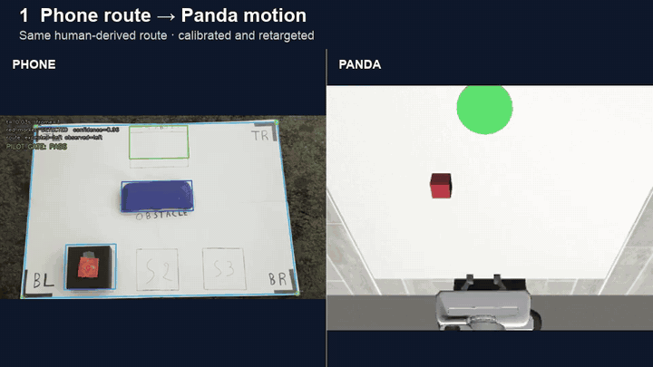
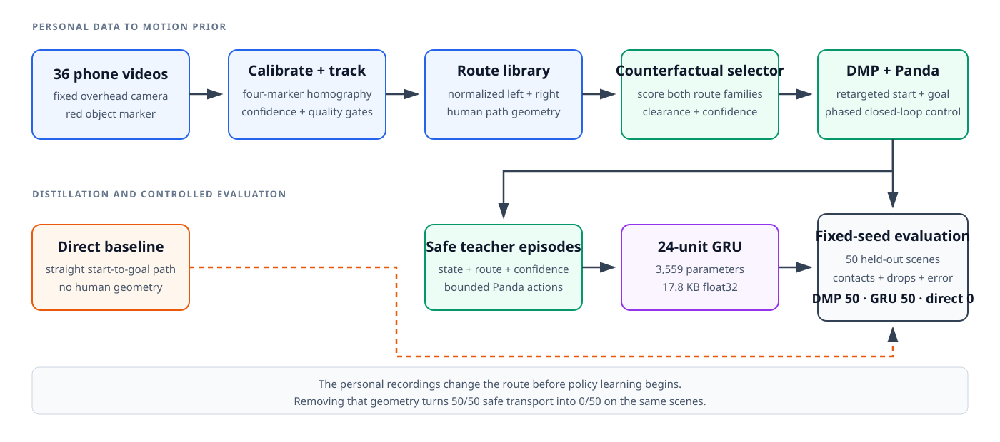

# Phone2Panda

**Personal phone demonstrations to route-aware Panda control.**

[70-second demo](media/phone2panda_demo.mp4) ·
[Design](docs/design.md) ·
[Results](results/phase5b/evaluation.json) ·
[Experiment log](docs/experiments.md) ·
[Model card](docs/model_card.md)

**Research question:** can one person's overhead phone demonstrations provide
path geometry that makes a Panda robot move an object around an obstacle more
safely than a direct controller?



Phone2Panda converts 36 personally recorded monocular videos into calibrated
left/right motion priors, scores both routes for a new scene, and distils the
selected behaviour into a 3,559-parameter GRU. The recordings determine the
robot's path; they are not labels or presentation footage around an unrelated
simulator policy.

## At a glance

| Personal data | DMP teacher | GRU policy | Direct baseline | Float32 model |
| ---: | ---: | ---: | ---: | ---: |
| 36/36 accepted videos | 50/50 safe | 50/50 safe | 0/50 safe | 17.8 KB |

All three controllers were evaluated on the same 50 fixed, held-out calibrated
scenarios. A safe success requires correct placement, a retained grasp, and no
object-obstacle, robot-obstacle, robot-table, or self contact.

## System



1. Four canvas markers calibrate each overhead recording into a unit workspace.
2. A red object marker becomes a confidence-weighted 2D trajectory.
3. Left and right demonstrations form route-specific DMP motion priors.
4. Candidate routes are retargeted to the seeded Panda scene and scored for
   obstacle clearance and demonstration confidence.
5. Safe DMP rollouts supervise a normalized 24-unit GRU, which is evaluated
   closed-loop rather than only by action-prediction loss.

## Results

<!-- BEGIN GENERATED RESULTS -->
The video dataset gate accepted **36/36 recordings**. On the same 50 held-out calibrated simulator scenarios:

| System | Safe success | Object collisions | Unintended contacts | Drops | Median placement error | Median clearance |
| --- | ---: | ---: | ---: | ---: | ---: | ---: |
| Human-derived DMP teacher | 50/50 | 0 | 0 | 0 | 1.53 mm | 22.07 mm |
| 24-unit GRU | 50/50 | 0 | 0 | 0 | 1.95 mm | 21.72 mm |
| Straight line | 0/50 | 50 | 50 | 5 | 20.21 mm | -48.56 mm |

Ablations are one-factor-at-a-time on 50 fixed scenarios:

- Demonstration count did not change safe success: 50/50, 50/50 and 50/50 for 5, 15 and 30 demonstrations.
- Calibration improved the safety margin: 50/50 safe with 22.07 mm median clearance versus 49/50 and 14.35 mm for naive scaling.
- Smoothing did not improve success here: both settings achieved 50/50; median clearance was 22.07 mm enabled and 24.22 mm disabled.
- Route/confidence filtering improved safety: 50/50 safe when enabled versus 47/50, with 3 object-collision rollouts, 1 unintended-contact rollout and 1 drop when disabled.
- Float32 reduced the checkpoint from 31,942 to 17,795 bytes but was slightly slower in this CPU benchmark (0.0127 vs 0.0121 ms median).
<!-- END GENERATED RESULTS -->

These are simulator measurements for the physically calibrated **40 mm**
glasses-case obstacle. The earlier 140 mm environment is retained as an
uncalibrated stress test and is not used as a headline physical result.
Machine-readable sources are
[`phase5b/evaluation.json`](results/phase5b/evaluation.json),
[`phase6/ablation_summary.json`](results/phase6/ablation_summary.json), and
[`phase6/precision_benchmark.json`](results/phase6/precision_benchmark.json).

## Why the personal data matters

The strongest causal check is removal. Replacing the human path with a direct
start-to-goal line changed safe success from 50/50 to 0/50 and caused an object
collision in every scenario. Keeping human paths but removing route/confidence
selection reduced safe success to 47/50. The contribution is therefore not
that a GRU can imitate a controller; it is the explicit path geometry extracted
from the recordings and the safety-aware choice between route families.

## Research decisions

| Initial assumption | Evidence | Decision |
| --- | --- | --- |
| Every corner marker had to remain visible throughout a recording. | Tracking stayed at 100% while a forearm briefly hid one marker during valid motion. | Calibrate from stable hands-free windows and gate camera drift and jitter separately. |
| A generic 140 mm obstacle was a reasonable simulation proxy. | Contact-pair auditing found Panda wrist collisions even when the object path was clear. | Measure the physical 40 mm obstacle, rebuild the geometry, and retain the failed setup as a stress test. |
| More demonstrations would automatically improve the controller. | The 5, 15, and 30 demonstration ablations all achieved 50/50 safe success. | Report saturation; route selection and calibration mattered more than volume for this task. |
| Float32 would be faster as well as smaller. | It reduced checkpoint size by 44% but was slightly slower in this CPU benchmark. | Keep the size result and make no speed claim. |

The complete chronological record is in the
[experiment log](docs/experiments.md) and
[decision log](docs/decisions.md).

## Reproduce

The bootstrap installs uv and CPython 3.11.17 inside the checkout, creates a
project-local environment, and does not modify global Anaconda.

```bash
make setup
make test                 # unit and integration tests
make smoke-demo           # decode and validate the public demo
make evaluate-existing    # verify committed results and README numbers
```

Full simulator runs require the private processed trajectories:

```bash
make phase4e   # calibrated controller comparison
make phase5b   # fixed train/validation/test GRU evaluation
make phase6    # fixed-seed ablations and precision comparison
```

The commands use pinned dependencies and fixed seed manifests. Raw recordings
are read-only and excluded from Git.

## Scope

Learning robot behaviour from human video, DMP retargeting, and compact
imitation policies are established ideas. Phone2Panda does not claim a new
general-purpose robotics algorithm or physical-robot validation. Its narrower
contribution is a reproducible, low-cost integration with unusually explicit
safety gates and controlled evidence that the personally collected paths alter
robot behaviour. See [related work](docs/related_work.md) for the closest
systems and the differences.

Main limitations:

- Simulation only; no claim of safe transfer to a physical Panda.
- One demonstrator, camera, object, and obstacle family.
- The tracker observes a marked 2D object path, not full 6D pose or contact.
- A public clone can validate code, media, checkpoints, and committed results,
  but cannot regenerate the private vision dataset.

See [known issues](KNOWN_ISSUES.md), the [dataset card](docs/dataset_card.md),
and the [model card](docs/model_card.md) for exact boundaries.

## Repository map

- `src/phone2panda/pilot_validation/`: decode, calibration, tracking, and gates
- `src/phone2panda/trajectories/`: smoothing, resampling, and DMPs
- `src/phone2panda/sim/`: robosuite Panda environment and phased control
- `src/phone2panda/policy/`: dependency-free normalized GRU
- `src/phone2panda/evaluation/`: fixed-scenario comparisons and ablations
- `configs/`: versioned experiment settings
- `results/`: selected machine-readable records and public-safe media

## Licence and citation

[References](docs/references.md) ·
[Third-party notices](THIRD_PARTY_NOTICES.md) ·
[Citation metadata](CITATION.cff)

Software is released under the [MIT License](LICENSE). Raw recordings are not
distributed under this licence.
